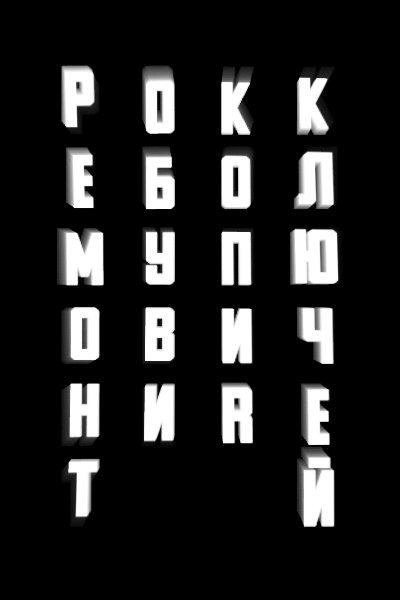

# PolyRock 21' Interactive Background

Hello 👋
This repository contains Processing java code for background of live performance on PolyRock'21.

## Demo

## Requirements
Install Processing IDE:
https://processing.org/

## How to launch
1. Clone this repository: `git clone https://github.com/kry127/RokkEbol`.
2. Open `RokkEbol.pde` in cloned repository
3. Ppress play in IDE interface

## Acknowledgement

This interactive image uses ezgif.com service for producing animated GIF files.

This interactive background is intended to be life background on life performance of group Oxygen Pub on PolyRock music festival.
Because why not?

